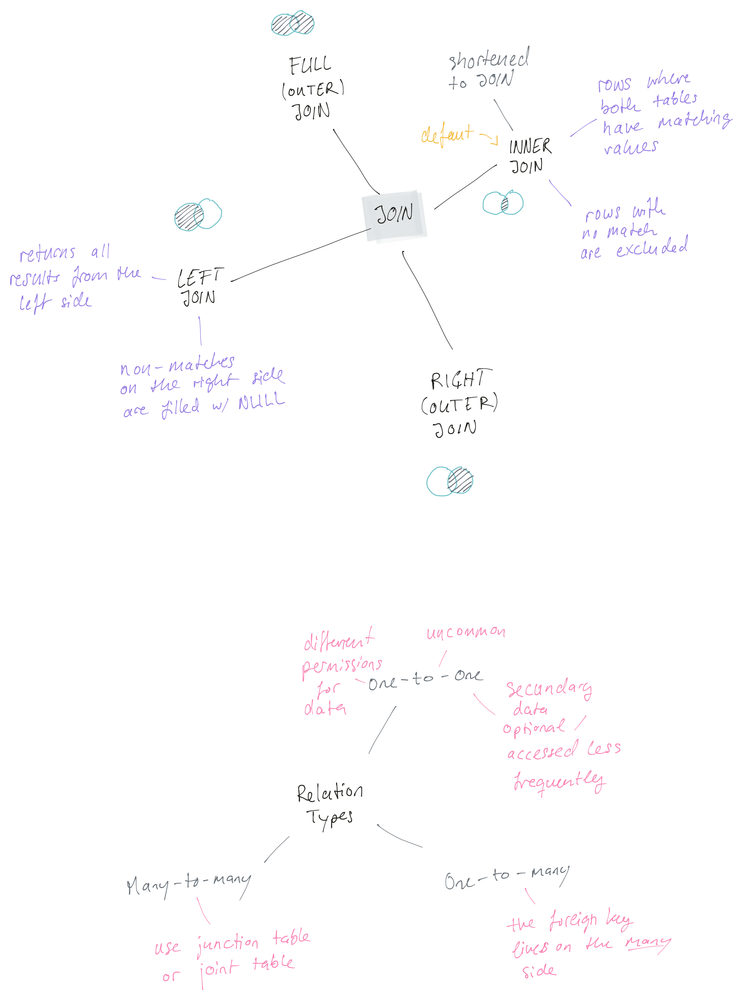
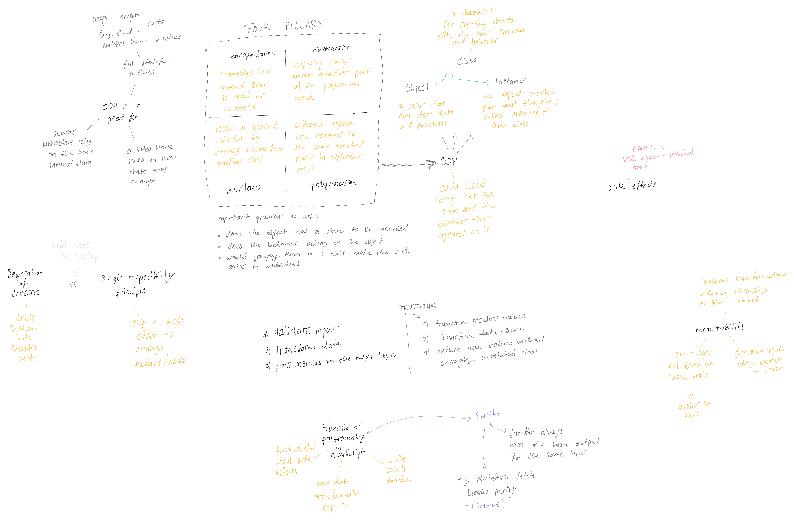

# Learning Concepts

* [TypeScript](#typescript)
* [SQL](#sql)
* [Programming Paradigm](#programming-paradigm)
* [Design Pattern](#design-pattern)

## TypeScript

## SQL

## Programming Paradigm

## Design Pattern

